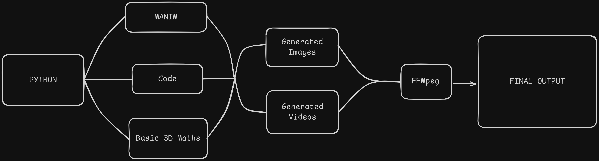
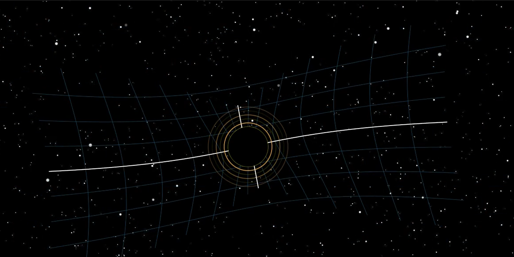

# Black Hole Animation using Manim

This repository contains a Python script and rendered video clip demonstrating a **Black Hole animation**, created using the [Manim](https://github.com/ManimCommunity/manim) animation engine. It visually simulates spacetime distortion and the gravitational pull around a black hole.

##  Preview

https://github.com/Kavy-Codes/Blackhole-Manim/issues/2#issue-3169043322


>  Made using **Python** + **Manim**



##  Files

- `blackhole.py` – Manim script that generates the animation.
- `blackhole.mp4` – Rendered output of the animation
- `README.md` – Project overview.

##  Requirements

- Python 3.7 or higher
- [Manim Community Edition](https://docs.manim.community/en/stable/)

### Install Manim

```bash
pip install manim
```

##  How to Render

To render the animation (low quality preview):

```bash
manim -pql blackhole.py BlackHoleScene
```

For high quality:

```bash
manim -pqh blackhole.py BlackHoleScene
```

> Make sure `BlackHoleScene` matches your actual scene class name.

##  Features

- Simulates black hole gravitational lensing
- Warped circular motion
- Clean and minimal code structure
- Smooth animation with customizable parameters

##  Inspiration

Inspired by astrophysical visualizations and the depiction of black holes in media such as *Interstellar*.

##  Screenshot

  


## 📜 License

This project is open-source and available under the **MIT License**.
